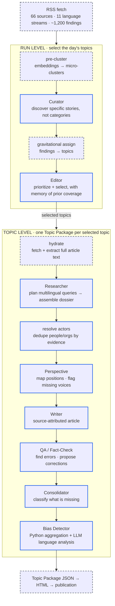

# Independent Wire

**The news you read was chosen for you. This system shows you why — and what's missing.**

**[→ Read the latest dossiers at independent-wire.org](https://independent-wire.org)**

Independent Wire is an open-source AI pipeline that produces multi-perspective news dossiers with full source transparency. It scans 66 sources across 11 language streams, identifies where coverage diverges, documents which voices are missing, and publishes everything — including its own biases and limitations.

No publisher. No engagement algorithm. No hidden editorial line. Every decision the system makes is traceable, auditable, and open.

> **AI cannot eliminate bias. But it can make it visible, cross-check it systematically, and reduce its impact.** That is the entire thesis — not perfect journalism, but journalism that is systematically *less distorted* and honest about its own limits.

## What It Produces

Independent Wire does not produce articles. It produces **Topic Packages / Dossiers** — structured transparency bundles. Each one contains:

- **The article** — source-based, multi-perspective, every claim traced to a cited source in its original language. Deliberately flat prose: every stylistic flourish is an editorial decision, and this system declines to make those decisions invisibly.
- **The perspectives** — who says what, how strongly represented, from which region; stakeholders grouped by position.
- **The divergences** — where sources contradict each other in fact, framing, or emphasis.
- **What is missing** — which voices (stakeholders, regions, languages) and which topics no source in the corpus covers.
- **The bias card** — analysis across language bias, source balance, and geographic coverage.
- **The reader note** — an honest self-assessment, placed *before* the article, not after.
- **The transparency trail** — why this topic was selected, what QA corrected, which sources were dropped and why.

The article is only one rendering of the Topic Package. The same structured data could drive a podcast briefing, a newsletter, or an API response — different formats, one transparent foundation. Today the system publishes two editions from that same data — English and German — the German rendered by a separate translation pipeline that works from the structured Topic Package, not the finished HTML.

## How It Works

A pipeline of specialized AI agents, orchestrated by deterministic Python. **No LLM decides what to do next** — Python code decides which agent runs when, with what input. This is a deliberate choice from operational experience: LLM-orchestrated workflows fail unpredictably; deterministic pipelines do not.

The pipeline runs on two levels. **Run-level** stages select the day's topics; **topic-level** stages then build one Topic Package per selected topic.

*Solid blue border = LLM-backed stage · dashed grey border = deterministic Python.*

Two principles run through every stage:

- **Deterministic before LLM** — if Python can do it (counting, ID assignment, field merging, date extraction), Python does it. LLMs are reserved for genuine judgment.
- **Agents produce only originary output** — pass-through data (URLs, outlet names, language codes) never travels through an LLM; Python merges it back. A model emits only what only it can produce.

### The model stack

Each stage uses the cheapest model that does its job well. Cheap, broad work (clustering, extraction) runs on fast models; expensive judgment (editorial, writing, bias) runs on stronger ones.

| Role | Model |
|---|---|
| Curator · Researcher-assemble · Actor resolution | DeepSeek V4 Flash |
| Hydration extraction · Consolidator | DeepSeek V4 Pro |
| Editor · Researcher-plan · Perspective · Writer · Bias | Claude Opus 4.6 |
| QA / Fact-Check | Claude Sonnet 4.6 |

All models are called through OpenRouter. **Every agent's prompt lives in the repo under `agents/`** — readable, forkable, and under the same license as the code.

## What This Is Not

Independent Wire is not a chatbot, not a news aggregator with a nicer UI, and not a replacement for investigative journalism. It cannot conduct confidential interviews, meet whistleblowers, or visit a factory. It relieves routine work so humans can do the work only humans can.

It is **not neutral** — nothing is. The models carry their training bias; RLHF adds more. What the system offers is not the absence of bias but transparency about where its bias lies. That is more than most systems offer, and the project says so plainly rather than promising an objectivity it cannot deliver.

Source balance is uneven, too. Western and English-language sources are over-represented; some regions are simply easier to reach by RSS than others. This is documented, not hidden — and improving it is an open workstream where contributions have direct impact.

## Project Status

Operational and publishing daily at [independent-wire.org](https://independent-wire.org).

| Component | Status |
|---|---|
| Pipeline (hydrated, 12 agents, 4 models) | ✅ Operational |
| Source base (66 feeds, 11 language streams) | ✅ Live |
| Topic Package rendering (self-contained HTML) | ✅ Live |
| Publication website | ✅ [independent-wire.org](https://independent-wire.org) |
| Bilingual edition (English + German) | ✅ Live — [independent-wire.org/de](https://independent-wire.org/de/) |
| RSS feed | ✅ [independent-wire.org/feed.xml](https://independent-wire.org/feed.xml) |
| Editor memory (coverage continuity) | ✅ Implemented |
| Data-driven visualizations (source-distribution terrain) | ✅ Live — more types planned |
| MCP server (query Topic Packages from LLM clients) | 🔜 Planned |
| Source expansion (underrepresented regions) | 🔜 Planned |

## Cost Transparency

The system runs on commercial AI APIs via OpenRouter. No advertising. No subscriptions. No data collection. **Operating cost = API cost, and nothing else.** Every run records its actual per-stage cost in the pipeline's run log.

A hydrated run that produces three Topic Packages costs a few euros in API calls — model choices are tuned per stage to keep that number low. The design goal is simple: operating cost must never create pressure to compromise editorial independence.

## Architecture

Three abstractions: **Agent** (a configured LLM caller), **Pipeline** (deterministic orchestration), **Tool** (a swappable external capability). Async throughout. No agent framework and no orchestration platform — just a small, well-understood dependency set: `openai` (the OpenRouter client), `httpx`, `feedparser`, `pydantic`, `fastembed` and `scikit-learn` (deterministic pre-clustering), and `json-repair`.

Details: [ARCHITECTURE.md](docs/ARCHITECTURE.md) · [AGENT-IO-MAP.md](docs/AGENT-IO-MAP.md) · [ROADMAP.md](docs/ROADMAP.md)

## License

**AGPL-3.0** — the strongest copyleft license available. Anyone who hosts Independent Wire must also open-source their modifications, including changed prompts. This is not a restriction. It is the license doing its job.

Who can read the prompts can check the agenda. Who can change the prompts is free.

## Contributing

The project is built by a single developer and is in active development. The best ways to contribute right now:

- **Read a dossier** at [independent-wire.org](https://independent-wire.org) and open an issue with feedback.
- **Review the prompts** in `agents/` — editorial improvements matter as much as code.
- **Expand the source base** — suggest feeds from underrepresented regions in `config/sources.json`.
- **Star the repo** to signal interest.

Read the [vision paper](docs/VISION-independent-wire.pdf) for the full rationale behind the project.

---

*Independent Wire — Because transparency is not a feature, it is a promise.*
